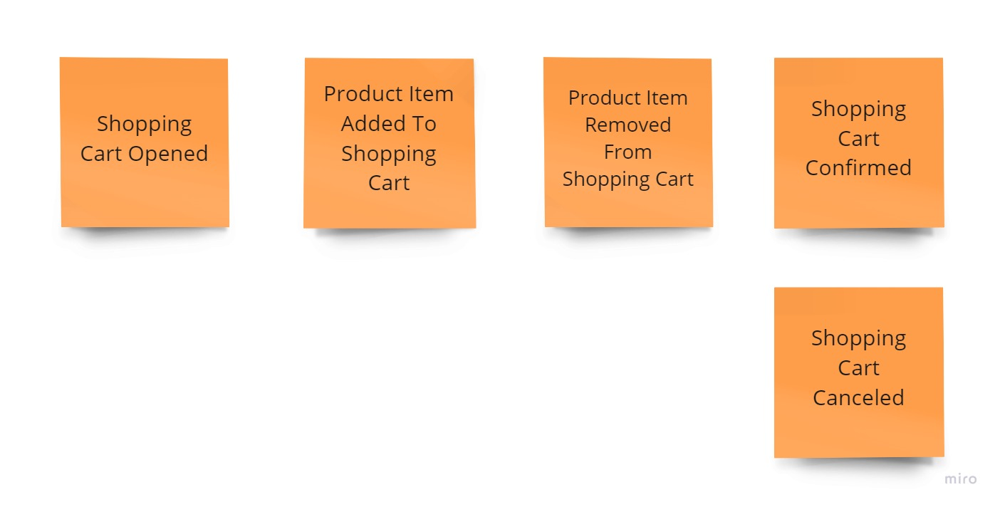

# Exercise 07 - Application Logic with Optimistic Concurrency

Having the following shopping cart process:

1. The customer may add a product to the shopping cart only after opening it.
2. When selecting and adding a product to the basket customer needs to provide the quantity chosen. The product price is calculated by the system based on the current price list.
3. The customer may remove a product with a given price from the cart.
4. The customer can confirm the shopping cart and start the order fulfilment process.
5. The customer may also cancel the shopping cart and reject all selected products.
6. After shopping cart confirmation or cancellation, the product can no longer be added or removed from the cart.

And business logic and application code implemented in the [previous exercise](../06_application_logic_eventstoredb/) update the application code to handle correctly optimistic concurrency. You need to map ETag conditional headers into expected stream revision correctly. Read more:

- [Optimistic concurrency for pessimistic times](https://event-driven.io/en/optimistic_concurrency_for_pessimistic_times/)
- [MDN - HTTP conditional requests](https://developer.mozilla.org/en-US/docs/Web/HTTP/Conditional_requests)
- [EventStoreDB Documentation - Handling concurrency](https://developers.eventstore.com/clients/grpc/appending-events.html#handling-concurrency)

This time you'll use EventStoreDB instead of the mocked one. Run `docker-compose up` before running test code to have database set up.

There are four variations:

1. Classical, mutable aggregates (rich domain model): [./oop/aggregate/applicationLogic.exercise.test.ts](./oop/aggregate/applicationLogic.exercise.test.ts),
2. Mixed approach, mutable aggregates (rich domain model), returning events from methods: [./oop/aggregate_returning_events/applicationLogic.exercise.test.ts](./oop/aggregate_returning_events/applicationLogic.exercise.test.ts),
3. Immutable, with functional command handlers composition and entities as anemic data model: [./immutable/functions/applicationLogic.exercise.test.ts](./immutable/functions/applicationLogic.exercise.test.ts),
4. Immutable with composition using [the Decider](https://thinkbeforecoding.com/post/2021/12/17/functional-event-sourcing-decider) pattern and entities as anemic data model: [./immutable/businessLogic.exercise.test.ts](./immutable/businessLogic.exercise.test.ts),
