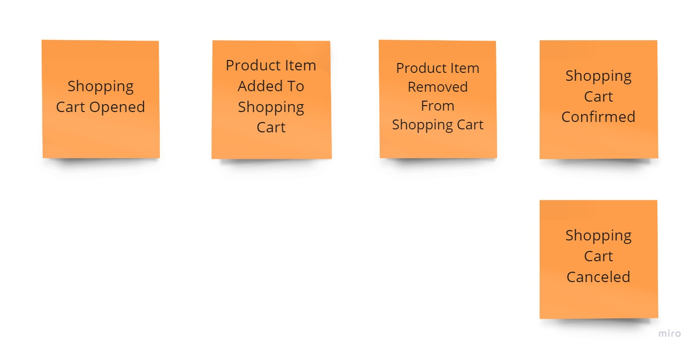

# Exercise 07 - Business Logic Tests

Having the following shopping cart process:

1. The customer may add a product to the shopping cart only after opening it.
2. When selecting and adding a product to the basket customer needs to provide the quantity chosen. The product price is calculated by the system based on the current price list.
3. The customer may remove a product with a given price from the cart.
4. The customer can confirm the shopping cart and start the order fulfillment process.
5. The customer may also cancel the shopping cart and reject all selected products.
6. After shopping cart confirmation or cancellation, the product can no longer be added or removed from the cart.

And the business logic implemented in the previous exercises **add missing unit tests to it**.

For Event Sourcing, the testing pattern looks like this:

- **GIVEN** set of events recorded for the entity,
- **WHEN** we run the command on the state built from events,
- **THEN** we’re getting new event(s) as a result of business logic. Or the exception is thrown.

See more in [Emmett documentation](https://event-driven-io.github.io/emmett/getting-started.html#unit-testing).

There are four variations:

- using mutable aggregates: [./oop/solution1/businessLogic.exercise.test.ts](./oop/solution1/businessLogic.exercise.test.ts),
- using mutable aggregates returning events: [./oop/solution2/businessLogic.exercise.test.ts](./oop/solution2/businessLogic.exercise.test.ts),
- using fully immutable structures with functions: [./immutable/businessLogic.exercise.test.ts](./immutable/solution1/businessLogic.exercise.test.ts),
- using fully immutable structures with decider: [./immutable/businessLogic.exercise.test.ts](./immutable/solution2/businessLogic.exercise.test.ts),
