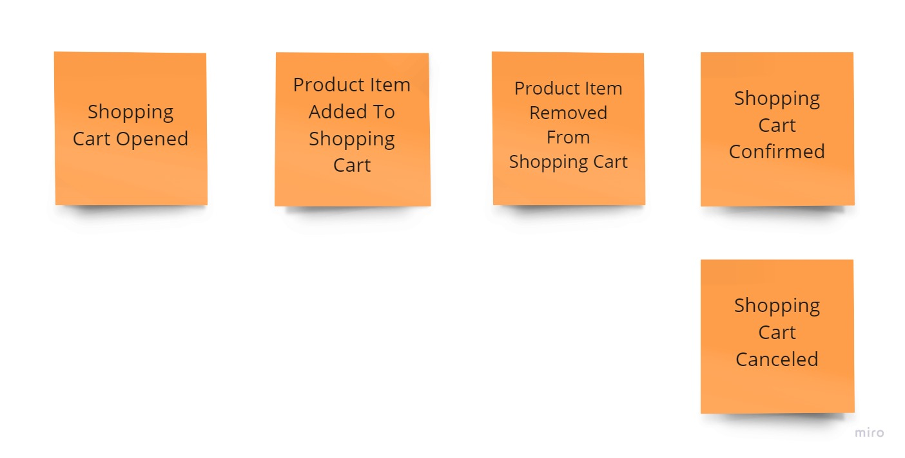

# Exercise 07 - Business Logic

Having the following shopping cart process:

1. The customer may add a product to the shopping cart only after opening it.
2. When selecting and adding a product to the basket customer needs to provide the quantity chosen. The product price is calculated by the system based on the current price list.
3. The customer may remove a product with a given price from the cart.
4. The customer can confirm the shopping cart and start the order fulfilment process.
5. The customer may also cancel the shopping cart and reject all selected products.
6. After shopping cart confirmation or cancellation, the product can no longer be added or removed from the cart.

Write the code that fulfils this logic. You can choose your prefered way to solve it, e.g.the Aggregate pattern, service, just pure functions or another way.Remember that in Event Sourcing each business operation has to result with a new business fact (so event). Use events and entities defined in previous exercises and new commands defined in `businessLogic.ts` file.

There are two variations:

- using mutable entities: [./oop/businessLogic.exercise.test.ts](./oop/businessLogic.exercise.test.ts),
- using fully immutable structures: [./immutable/businessLogic.exercise.test.ts](./immutable/businessLogic.exercise.test.ts),

Select your preferred approach (or both) to solve this use case.

## Solution

1. Classical, mutable aggregates (rich domain model): [oop/solution1/businessLogic.solved.test.ts](./oop/solution1/businessLogic.solved.test.ts).
2. Mixed approach, mutable aggregates (rich domain model), returning events from methods: [oop/solution2/businessLogic.solved.test.ts](./oop/solution2/businessLogic.solved.test.ts).
3. Immutable, with functional command handlers composition and entities as anemic data model: [./immutable/solution1/businessLogic.solved.test.ts](./immutable/solution1/businessLogic.solved.test.ts).
4. Immutable with composition using [the Decider](https://thinkbeforecoding.com/post/2021/12/17/functional-event-sourcing-decider) pattern and entities as anemic data model: [./immutable/solution2/businessLogic.solved.test.ts](./immutable/solution2/businessLogic.solved.test.ts).

Read also my articles:

- [Straightforward Event Sourcing with TypeScript and NodeJS](https://event-driven.io/en/type_script_node_Js_event_sourcing/?utm_source=eventsourcing_nodejs?utm_campaign=workshop)
- [How to effectively compose your business logic](https://event-driven.io/en/how_to_effectively_compose_your_business_logic//?utm_source=eventsourcing_nodejs?utm_campaign=workshop)
- [Slim your aggregates with Event Sourcing!](https://event-driven.io/en/slim_your_entities_with_event_sourcing/?utm_source=eventsourcing_nodejs?utm_campaign=workshop)
